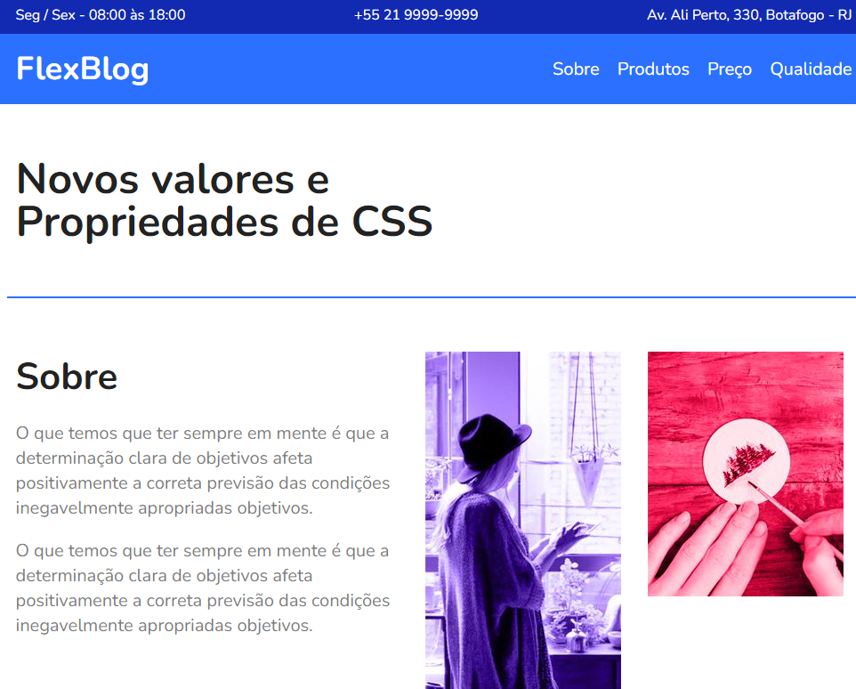

<h1 align="center"> CSS Flexbox </h1>

##  Tecnologias

Esse projeto foi desenvolvido com as seguintes tecnologias:

- HTML e CSS
- Git e Github

##  Layout

O curso do origamid CSS Flexbox está disponivel gratiutamente atravez [DESSE LINK](https://www.origamid.com/curso/css-flexbox/). 

 

  

